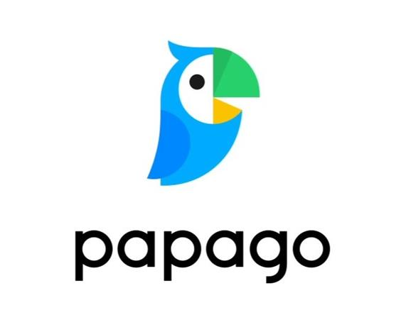
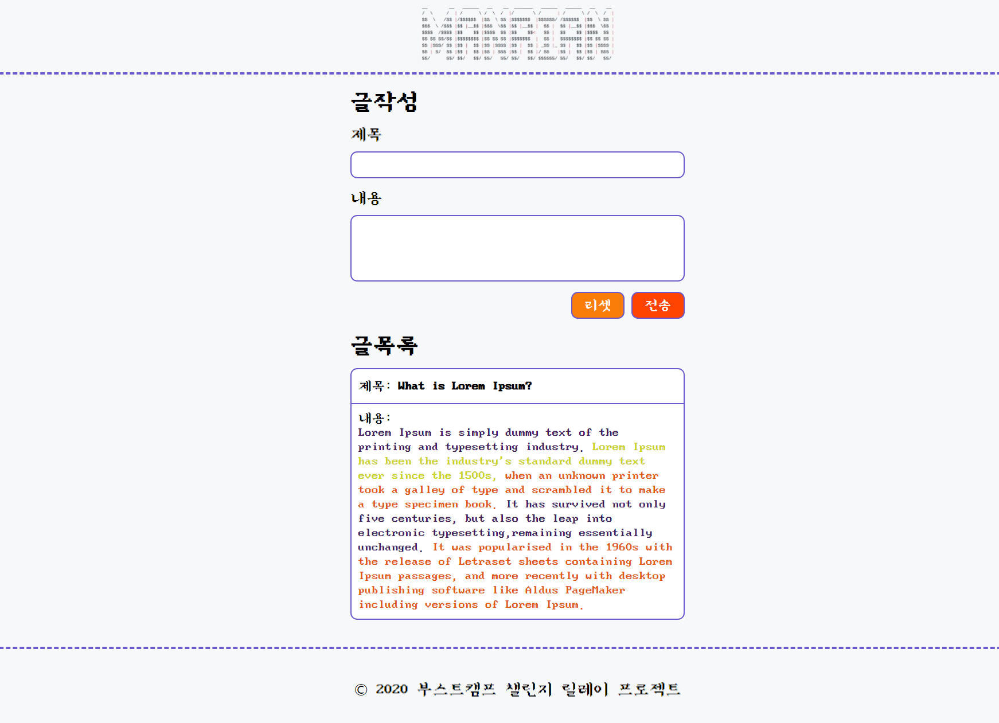
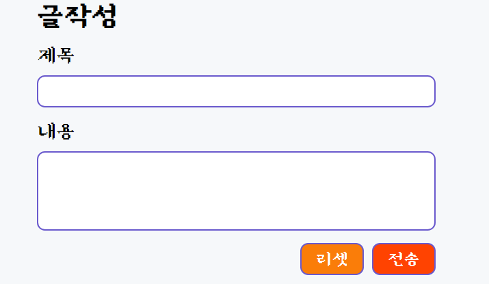
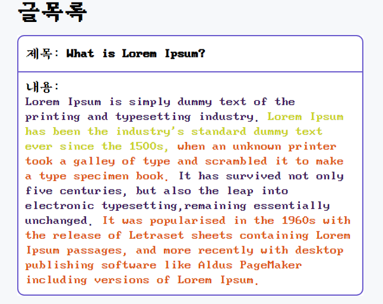
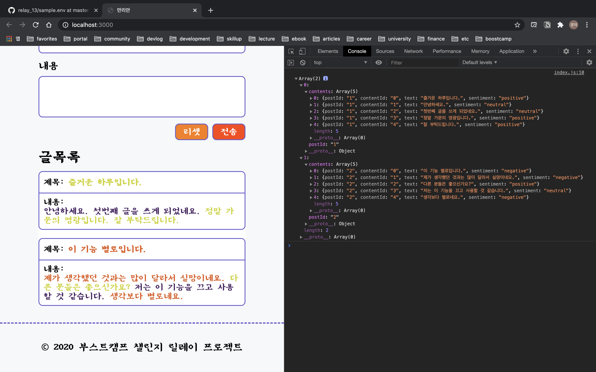

# Week 2. 자연어 처리

## 1. 개요

  - ### 1. 프로젝트 주안점

    - ##### 캐주얼 프로그래밍

      릴레이 프로젝트는 즐기기 위한 프로젝트라는 마스터 님 말씀에 착안하여, 기능 구현에 우선한 숏 코딩을 지향해 시중에서 제공하고 있는 api 를 적극적으로 활용했습니다.

      
       

    - #### 페어 프로그래밍
    
      즐기기 위한 프로젝트를 진행하기 위해, 기능을 크게 4 파트로 나눠서 3인 1조로 페어 프로그래밍을 진행하봤습니다.

      
      
      
      

  - ### 2. 기능 구현 목록
  
    - #### UI ( Vanilla JS )
    - #### 서버 ( Node.js Express )
    - #### 번역 API ( papago )
    - #### 자연어 처리 API ( Azure )
  
## 2. 기능 구현

  - ### 1. UI
  
    - #### 전체 UI
    
      - 로고와 글작성, 글목록이 포함되어 있습니다.
      - [도스명조 폰트 사용](https://noonnu.cc/font_page/238)
      
      
      
    - #### 글 작성 목록 UI
    
      글 작성 UI에는 글의 내용과 감성 분석 결과를 보여줄 내용을 작성합니다. 리셋 버튼을 통해서 글을 초기화 할 수 있고, 전송버튼을 누르면 데이터가 웹서버로 전송이 됩니다.
    
      
      
    - #### 글 목록 UI
     
      입력했던 글 제목과 내용을 리스트 형태로 보여줍니다. 내용은 긍정(라임)/부정(주황)/중립(남색)의 3 단계로 나눠서 색깔로 표시를 해줍니다.
     
       

  - ### 2. 서버
  
      - Node.js 환경에서 Express 서버 프레임워크를 사용
      - DB 대신 정적 JSON 파일을 사용하여 클이언트에 데이터 제공
      - Azure 자연어 처리 API가 한글 보다는 영어 데이터에 더 정확한 분석을 제공하기 때문에, 한글을 번역 API를 통해 영어로 전환하여 자연어 처리 API를 호출
        ```
        클라이언트 -> 서버 -> 번역 API -> 서버 -> 자연어 처리 API -> 서버 -> 클라이언트
        ```
  
  - ### 3. 번역 API
  
      - [파파고 API 활용](https://developers.naver.com/docs/papago/)

  - ### 4. 자연어 처리 API
  
      - [MS Azure 감정 분석 API 활용](https://docs.microsoft.com/ko-kr/azure/cognitive-services/text-analytics/quickstarts/nodejs#analyze-sentiment)

        
